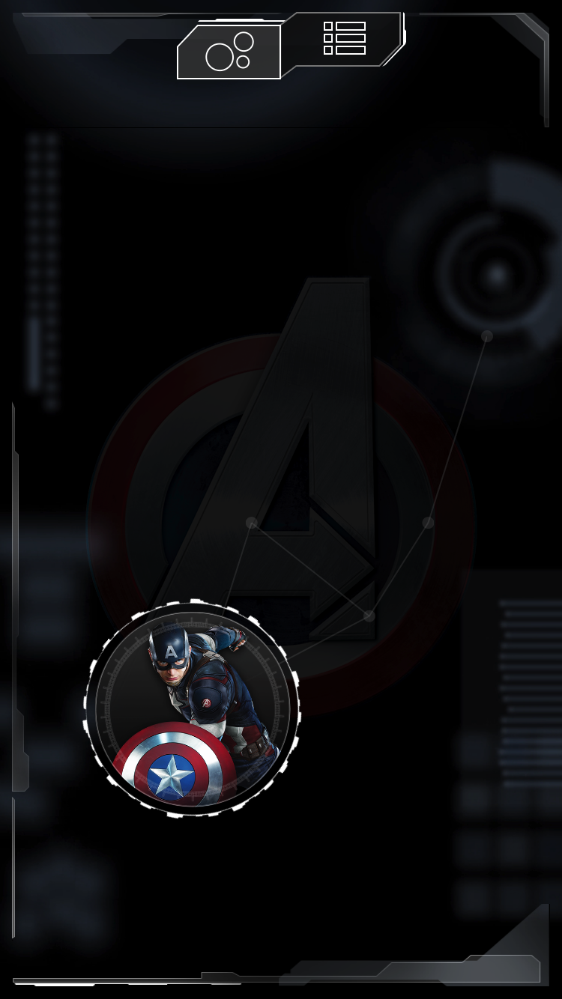

# Exhibition Challenge

Thank you for your interest in the Acoustiguide Interactive exhibition challenge.

## The Objective

The objective for this challenge is fairly simple:

Develop a bare-bone iOS user interface for an exhibition application based on the Avengers theme.

This challenge is inspired by the Avengers S.T.A.T.I.O.N. mobile application (iOS / Android) developed by us, available from the App Store for free.

As a general time guide, the challenge was completed by us in 3 hours, bonus points one extra hour.
You have all the time you need to complete the challenge at your leisure.

Don't publish your solution on Github.  For any questions, contact us via: http://interactive.acoustiguide.com

## Layout

The target layout for this challenge involves:

 - An animating background which plays a movie of ornaments on repeat.
 - A centered shield image representing the currently active field/topic, opacity down to 10%.
 - Images at the top, bottom and left side framing the layout at an offset from the edges of the container matching the default layout margins.
 - Two buttons at the center-top, representing the UI modes, also offset by the layout margins.
 - The first of the buttons should be highlighted, as it is the currently active mode, switching modes is not possible.
 - A field displaying circles and connected dots for content; the field is inset by 50 points horizontally and 100 vertically.

# The Field

The field shows the content available to the user in the currently active topic.  For this challenge, the only topic is the Captain America topic.

The field is made up of an imaginary grid of 8 horizontally, and 16 vertically.  In this grid, we place one "available" circle, represented by a circular image, and four "unavailable" circles, represented by grey dots.

Each circle, available or not, is connected to its two nearest neighbours by a line of the same shade as the grey dots.

The circles should be placed on the grid randomly.

# The Circle

Circles represent items the user can investigate.  They are initially "unavailable" and marked as grey dots, but become available throughout the experience.  In the challenge, circles do not need to be able to change state.

An "unavailable" circle is just a light grey dot, diameter of 8 points, opacity 20%.

The "available" circles can be either "large", "medium" or "small".  This normally depends on the content of the item, but for the challenge we choose a random mode.  The different size circles use a different size circle image.  The circles are sized to match their circle image.  Inside the circle, we fit the item's content image, which can always be `thumb_ca` for the purpose of the challenge.  Around the circle, we have a white "ring", at 8 points distance from the circle.

# Your Code

The goal of this challenge is to show us the type of code that you normally write.  Try to be conscious of your output.  The goal is not to narrowly solve the challenge requirements, but rather to write a basic exhibition app in such a way that it can be maintained and built out into a healthy fully-featured application.  Think about classes, responsibilities, transparency, object-oriented principles, and above all, types.

The code of this application is fully Objective-C.  There is no Storyboard, no XIBs, no Swift.

The challenge comes with a barebone Xcode project with some code in place, all you need to do is run the app and complete.  Take note of what is there, and show us that you can learn how existing code works by adopting the style and approach of the current application.

It is OK to test in the simulator only.

Good luck!

# Bonus Points

If you wish, you can solve the following extra challenges to stand out from the crowd and impress us.

1. Whenever the user taps the first header button, the circles layout should be re-shuffled to a new layout.
2. The ring should rotate around the circle in a constant motion, making a full circle once every 40 seconds.
3. When the user taps a circle, the circle should re-configure itself to a random new "available" mode.
